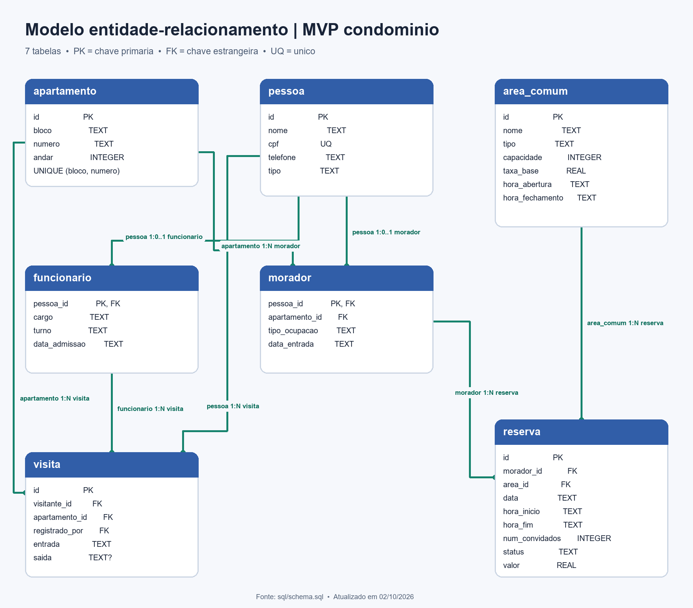

# D01 — Modelo entidade-relacionamento do MVP

O diagrama representa o estado de `sql/schema.sql` em 02/10/2026. Cada caixa é uma tabela; `PK` identifica a chave primária, `FK` uma chave estrangeira, e `UQ` uma restrição de unicidade. O lado `1` é o registro referenciado e `N` representa vários registros possíveis.

As sete tabelas são `apartamento`, `pessoa`, `morador`, `funcionario`, `area_comum`, `reserva` e `visita`. `morador` e `funcionario` usam `pessoa_id` como PK e FK para `pessoa.id`, o que permite no máximo uma linha de cada subtipo para cada pessoa. O campo `pessoa.tipo` distingue morador, visitante e funcionário; visitantes não têm tabela própria. `reserva.morador_id` referencia `morador.pessoa_id`, enquanto `visita.visitante_id` referencia `pessoa.id` e `visita.registrado_por` referencia `funcionario.pessoa_id`.

As chaves estrangeiras devem estar habilitadas em cada conexão SQLite com `PRAGMA foreign_keys = ON`. O diagrama mostra as relações físicas; regras adicionais, como somente porteiros registrarem visitas e conflito de reservas, são aplicadas pelos serviços e verificadas em `docs/testes.md`.

Para regenerar a imagem, execute `python docs/gerar_diagrama_er.py` com Pillow instalado. A fonte de verdade do modelo continua sendo `sql/schema.sql`; se o esquema mudar, atualize também os campos e relações no script antes de regenerar o PNG.
